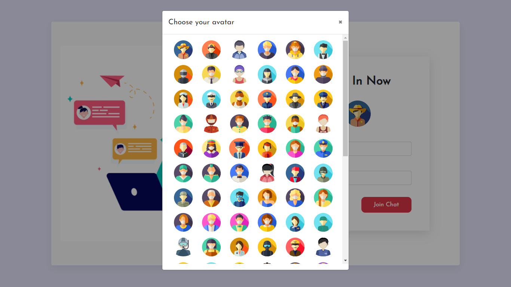
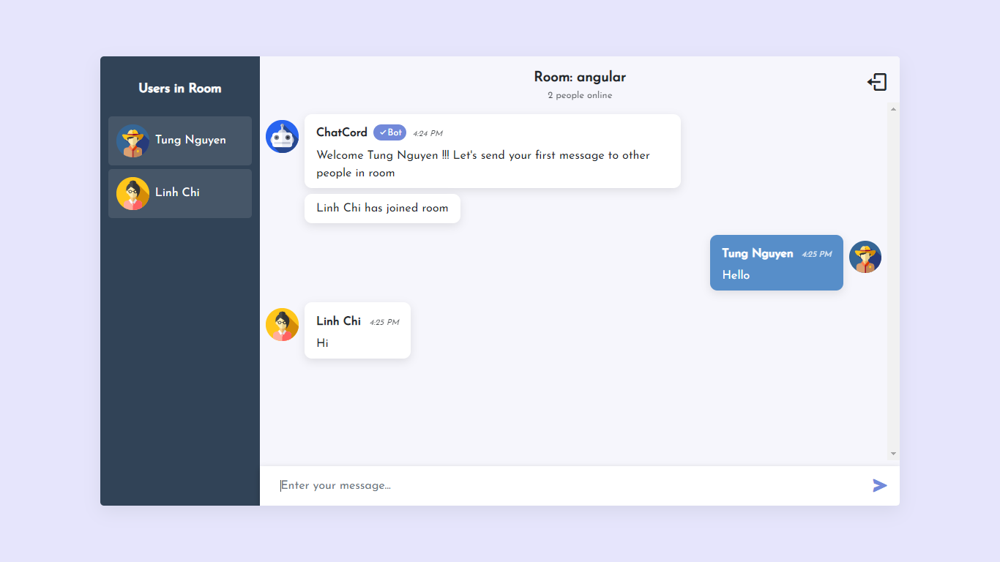

# Chat Cord

Realtime chat app with websockets using Node.js, Express and Socket.io with Angular on the frontend

## Working application

-  Live demo: [Chat Cord](https://chat-cord.vercel.app)

## Visuals





## Tech stack


- [Angular CLI](https://angular.io/)
- [SocketIO](https://socket.io/)
- [NodeJS](https://nodejs.org/en/docs/)
- [Express](https://expressjs.com/)
- [Bootstrap 4](https://getbootstrap.com/)
## Installation

Use the package manager [npm](https://www.npmjs.com/) to install and run.

```bash
npm install
npm start
```
## Support
If you like my work, feel free to:

- ⭐ this repository. And we will be happy together :)

Thanks for supporting me!

## Author

- Nguyen Manh Tung - mtung199x@gmail.com
